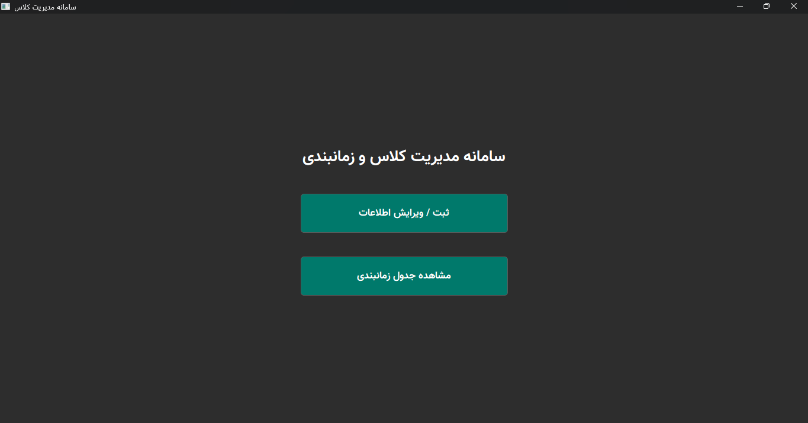

# سامانه مدیریت کلاس و زمانبندی

[](https://opensource.org/licenses/MIT)

یک نرم‌افزار دسکتاپ برای مدیریت اطلاعات دانشگاه‌ها، کلاس‌ها، دانشجویان و زمانبندی هفتگی آن‌ها با رابط کاربری گرافیکی. 




---

## 🚀 ویژگی‌ها

- **مدیریت دانشگاه‌ها:** افزودن، ویرایش و حذف دانشگاه‌ها.
- **مدیریت کلاس‌ها:** ثبت کلاس‌های جدید با تعیین روز، ساعت شروع و پایان و جلوگیری از تداخل زمانی.
- **مدیریت دانشجویان:** ثبت اطلاعات دانشجویان و تخصیص آن‌ها به کلاس‌های تعریف شده.
- **جدول زمانبندی پویا:** نمایش گرافیکی تمام کلاس‌ها در یک جدول هفتگی.
- **رابط کاربری مدرن:** طراحی شده با تم تیره و استایل‌های سفارشی برای تجربه کاربری بهتر.
- **ذخیره‌سازی پایدار:** تمام اطلاعات به صورت خودکار در یک فایل `JSON` ذخیره و در اجرای بعدی بارگذاری می‌شوند.

---

## 🛠️ تکنولوژی‌های استفاده شده

- **زبان برنامه‌نویسی:** Python 3
- **کتابخانه رابط کاربری:** PyQt6
- **فرمت ذخیره‌سازی داده:** JSON
- **سیستم کنترل نسخه:** Git & GitHub

---

## ⚙️ نصب و راه‌اندازی

برای اجرای این پروژه، مراحل زیر را دنبال کنید:

۱. ابتدا مخزن را از گیت‌هاب کلون (دانلود) کنید:
   ```bash
   git clone [https://github.com/mojtabakalami/class-schedule-manager.git]
   ```

۲. وارد پوشه پروژه شوید:
   ```bash
   cd class-schedule-manager
   ```

۳. کتابخانه‌های مورد نیاز را با استفاده از فایل `requirements.txt` نصب کنید:
   ```bash
   pip install -r requirements.txt
   ```

۴. برنامه را اجرا کنید:
   ```bash
   python main.py
   ```
   *توجه: برنامه در اولین اجرا، فایل `schedule_data.json` را برای ذخیره‌سازی اطلاعات به صورت خودکار ایجاد می‌کند.*

---

## 📂 ساختار پروژه

کد این پروژه برای خوانایی و توسعه‌پذیری بهتر به چندین ماژول تقسیم شده است:

- **`main.py`**: نقطه شروع اصلی برنامه. مسئول اجرای برنامه و مدیریت پنجره اصلی و صفحات است.
- **`config.py`**: شامل تنظیمات و مقادیر ثابت مانند روزهای هفته و مسیر فایل داده.
- **`data_manager.py`**: مسئول تمام عملیات مربوط به داده‌ها (بارگذاری و ذخیره‌سازی از/به فایل JSON).
- **`utils.py`**: مجموعه‌ای از توابع کمکی برای جستجو، اعتبارسنجی و مرتب‌سازی داده‌ها.
- **`ui_dialogs.py`**: شامل کلاس‌های پنجره‌های محاوره‌ای (Dialog) برای افزودن/ویرایش اطلاعات.
- **`ui_views.py`**: کلاس‌های مربوط به ویجت‌های اصلی برنامه (صفحه منو، صفحه ثبت‌نام و جدول زمانبندی).
- **`requirements.txt`**: لیست کتابخانه‌های مورد نیاز پروژه.
- **`.gitignore`**: مشخص می‌کند کدام فایل‌ها نباید به گیت‌هاب ارسال شوند.


